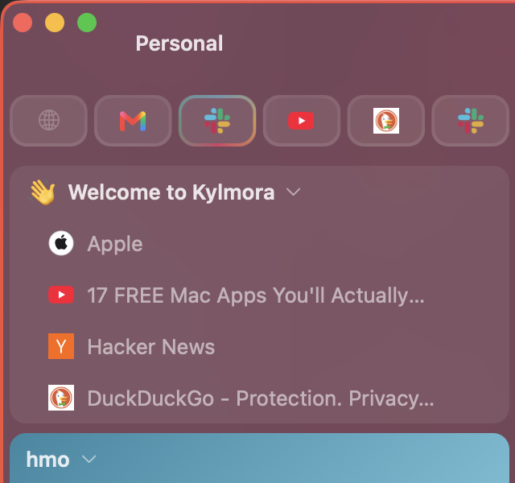

# Kylmora


[](https://github.com/kylmora/kylmora/actions/workflows/ci.yml)

**A lightweight, native macOS browser.** An AppKit shell over the system WebKit,
one window with Spaces inside it, and no bundled engine or third-party
dependencies. The whole app is a few hundred Swift files linking only Apple's
frameworks, and the release bundle is about 5 MB.

<p align="center">
  
</p>

[kylmora.com](https://kylmora.com)

> **Status:** a complete daily browser. Spaces with separate identities,
> sync, a command palette, automations, autofill, a PDF viewer, translation
> on the Mac's own model, extensions and content blocking all work. Nothing
> in the UI is a mock: if a control is there, it does something, and a
> feature that cannot work on macOS says so instead of pretending. There is
> no AI in it and nothing is sent anywhere about you or your Mac.

**Contributions are welcome** — see [Contributing](#contributing).

## Contents

- [Install](#install)
- [Features](#features)
- [Requirements](#requirements)
- [Building from source](#building-from-source)
- [Project layout](#project-layout)
- [Driving it from outside](#driving-it-from-outside)
- [Keyboard shortcuts](#keyboard-shortcuts)
- [Contributing](#contributing)
- [Performance](#performance)
- [Where data lives](#where-data-lives)
- [Updates](#updates)
- [Name and icon](#name-and-icon)
- [License](#license)

## Install

Download the latest build from the releases page:
**https://github.com/kylmora/kylmora/releases/latest**

- `Kylmora.dmg` for people: open it and drag Kylmora to Applications.
- `Kylmora.pkg` for fleets: an installer a device-management tool can push
  silently.

Both are signed with a Developer ID and notarized by Apple, so they open
without a security warning. Kylmora checks for new releases itself and can
download them in the background; see [Updates](#updates).

Prefer to build it yourself? See [Building from source](#building-from-source):
macOS 14+ and a Swift 6 toolchain, no Xcode required.

Rolling it out to an organisation? [docs/enterprise-policies.md](docs/enterprise-policies.md)
covers deploying the `.pkg` through Jamf, Intune, Kandji and the rest, and
locking settings across a fleet with a configuration profile or a
`policies.json`. Samples are in `Resources/Enterprise/`.

## Features

### One window, many Spaces

- One window. Spaces and tabs switch inside it, never by opening another
  window. A vertical sidebar holds the omnibox, navigation, the active Space's
  tabs and the Space switcher; it can be always expanded, icons only, compact
  (slides in on hover), on the left or the right, or hidden. A horizontal tab
  bar above the page (⌃⌘B) is there for people who want tabs where every other
  browser puts them, and can be dragged to reorder.
- **Spaces are identities.** Each has its own cookies and logins, so the same
  site can be signed into as a different account in each one. A private Space
  writes nothing to disk and comes back empty on relaunch.
- **A look per Space:** light or dark, a colour or a gradient, a page's own
  theme colour on the chrome if the Space allows it, a solid, glass or
  gradient rim around the window so any corner of the screen says which
  identity is in front, a bookmarks bar, default fonts, full-screen behaviour.
  Export the whole look as a `.kylmoratheme` file and import it on another Mac.
- **Per-Space settings** on top of the look: downloads folder, bookmarks
  folder, which extensions run, password vault, proxy, search engine, user
  agent, tab sleep delay and default zoom.
- **Space routing:** rules that open matching addresses in a given Space, with
  an editor in Settings and a default for links arriving from other apps.
- Zen mode hides everything but the page. Compact mode, a keep-on-top window,
  window borders and a sidebar density setting (compact, regular, roomy) are
  all there.

### Tabs

- Tabs are lazy: one that has not been shown has no web view and no WebKit
  process behind it. Background tabs sleep after an idle period and under
  memory pressure, and reopen where they were. Old tabs can be archived out of
  the sidebar on a schedule and brought back from the archive.
- Tab groups with names, emoji, icons and tints, nested; live folders that
  fill themselves from an RSS feed or a GitHub repository's issues and pull
  requests. Pinned sites per Space, and Essentials pinned across every Space.
- Per tab: rename, a colour tag, an emoji in place of the favicon, a note in
  the tooltip, keep awake, keep in sidebar, lock against closing, mute, auto
  reload every 10 seconds to 15 minutes. An unread dot appears when a page
  changes its title while its tab is out of sight; a ⧉ marks tabs another tab
  duplicates.
- Multi-select tabs, close duplicates, sort by title, domain or last use,
  reopen closed tabs, a tab overview grid (⇧⌘\) with live thumbnails and
  search across every Space, and a task manager showing each tab's CPU
  and memory.
- Split view: side by side, stacked, or a 2×2 grid, with sticky panes. Glance
  peeks at a link over the page; Little Arc opens one in a small window of its
  own. Web panels dock a site beside the page, and a site can be installed as
  a standalone Dock app.
- Sessions restore on launch, including each tab's scroll position, form
  contents and back-forward history, without reloading from the network.

### Getting around

- The command palette (⌘K or ⌘L) ranks open tabs, Spaces, history, bookmarks,
  commands and searches together as you type. Every feature is a command, and
  a custom command of your own can join them.
- Search engines with keywords and custom engines from any site's search box:
  `g cats`, `!g cats` and `cats !g` all search the engine whose keyword is `g`.
  A separate engine for private Spaces.
- New tabs open on a native start page: the Space's pinned and most visited
  sites as tiles, recently closed tabs and the unread reading list, drawn in
  the window with nothing fetched. The search engine's page or a homepage are
  the other choices.
- History with omnibox completion ranked by how often and how recently you
  visited, plus full-text search of page contents. Bookmarks with folders and
  tags, a bookmarks bar per Space, and a reading list with offline copies.
- Mouse gestures, rocker gestures, trackpad swipes, vim keys, link hints, and
  every keyboard shortcut customisable, including chords such as ⌘K then T.
  ⌘/ shows a cheat sheet of all of them.

### Pages

- Reader mode, with Read Aloud, and a per-site "always use Reader".
- Page translation with Apple's on-device model (macOS 15 and later). The text
  never leaves the Mac, and the page updates as each part comes back.
- A PDF viewer of Kylmora's own: thumbnails, page number, zoom, search with a
  match count, rotate, Open in Preview and Save. Per site, choose Kylmora's
  viewer, WebKit's, a download, or Preview.
- Print and Page Setup through WebKit's own pagination, Export as PDF, View
  Page Source with line numbers, Copy as Markdown Link, Copy Title and URL.
- Screenshots of the visible area or the whole page, to a file or the
  clipboard, or into an editor with crop, arrows, boxes, circles, highlight,
  an irreversible blur and text.
- Boosts: your own CSS and JavaScript per site, and a universal dark mode.
  Picture in Picture on any video, automatically when you switch tabs if you
  like, and a native video player for sites whose own player fights you.
- Find in page with match marks on the scrollbar, zoom per site, JSON
  documents shown formatted, custom fonts and a minimum font size.

### Content blocking and privacy

- Content blocking through WebKit's own content rule lists, fed by EasyList,
  EasyPrivacy, the cookie-banner lists and uBlock Origin's filters, fetched
  anonymously and on by default. Add your own lists and rules, pick an element
  on a page to block, and switch blocking off for one site.
- Cookie banners rejected automatically. Tracking parameters stripped from
  links. Hostile page behaviour undone: text made selectable, the right-click
  menu given back, the clipboard shielded.
- Anti-fingerprinting: canvas, WebGL and audio noise, hardware masking,
  randomised per Space. A custom user agent, globally, per Space or per site.
- Twenty-nine per-site settings, each with a default and per-site exceptions:
  Reader, auto-play, zoom, pop-ups, notifications, downloads, camera,
  microphone, screen sharing, location, content blockers, tracking
  prevention, cookies, JavaScript, web fonts, images, clipboard reading,
  referrer, certificate checks, user agent, compatibility mode, external
  apps, Picture in Picture, tab sleeping, forget when closed, native video
  player, anti-fingerprinting, hostile-behaviour protection, PDF documents.
- Website data manager, clear on quit with an allow-list, scheduled history
  and cookie removal, a RAM-only cache mode, a reset, and local crash reports
  you decide about. Touch ID or a master password can lock the browser.
- Encrypted DNS: Kylmora writes a system configuration profile for
  Cloudflare, Quad9, Google, AdGuard or a custom resolver, because page loads
  use the Mac's own DNS and only a profile can switch that to DNS over HTTPS.
  An HTTP or SOCKS proxy can be set globally or per Space.
- Favicons are fetched anonymously outside every Space, so the request
  carries no cookies and no identity. The address bar shows the page you are
  actually looking at, never a navigation that has not committed.

### Passwords and forms

- Logins saved in the macOS login Keychain, the store Safari uses, so they
  sync with iCloud Keychain and Kylmora keeps no password database of its own.
  Offer to save, offer to fill, submit automatically, Touch ID before a fill.
- AutoFill for names, addresses and contact details from saved identities,
  and for payment cards whose numbers live in the Keychain: filled only on
  secure pages, after Touch ID, never submitted, and the security code is
  never stored.

### Automations

- Rules that act when a page loads, a tab sits idle, media starts playing or
  a download finishes: move to a Space, pin, mute, keep awake, open in Reader,
  set zoom, archive, close, show a message, open an address, run an Apple
  Shortcut or an AppleScript. Rules export and import as JSON.
- A rule set to run from the command palette is a custom command, with a
  keyboard shortcut of its own if you want one.

### Extensions, sync and import

- Extensions on WebKit's own extension engine, which reads the manifest
  format Chrome and Firefox extensions use: paste a Chrome Web Store or
  addons.mozilla.org link in Settings, or install a `.zip`, `.crx`, `.xpi` or
  an unpacked folder (macOS 15.4 and later). Enable them per Space.
- **Native messaging:** an extension can talk to an app installed on the Mac,
  which is what a password manager's extension is for -- the vault lives in
  the app and the extension is a front end. Kylmora reads the host manifests
  apps install for Chrome and Firefox as well as its own, because almost no
  app ships one for Kylmora, and the app's own manifest still decides which
  extensions may reach it. Settings ▸ Extensions lists what is installed,
  says why a manifest was refused, and can switch any of it off. See
  [docs/native-messaging.md](docs/native-messaging.md).
- Sync through iCloud, Google Drive, Dropbox, OneDrive, Nextcloud or WebDAV,
  or any folder: open tabs, bookmarks, website settings and rules, and
  optionally the last 2,000 visits of history. With a passphrase the archive
  is encrypted end to end before it leaves the Mac, and only then can saved
  passwords travel with it; they never go to CloudKit. Export and import the
  whole sidebar as a backup.
- Import bookmarks, history, open tabs and cookies from Safari, Chrome, Edge,
  Brave and Firefox, and a sidebar from Arc. An iPhone Shortcut sends links to
  a Kylmora inbox on the Mac.

### For organisations

- Nineteen policies delivered by MDM configuration profile or a
  `policies.json`: homepage, new tab, search engine, URL block and allow
  lists, extensions, developer tools, private browsing, the password manager,
  content blocking, native messaging, updates, a DNS resolver, a RAM-only
  cache. Kylmora ▸
  Enterprise Policies… shows what is in force. See
  [docs/enterprise-policies.md](docs/enterprise-policies.md).

## Requirements

- macOS 14 (Sonoma) or later, for per-Space `WKWebsiteDataStore`. Page
  translation needs macOS 15; extensions need macOS 15.4.
- To build: a Swift 6 toolchain. **Xcode is not required.** The Command Line
  Tools are enough (`xcode-select --install`).

## Building from source

Everything goes through the `Makefile`:

```sh
make run      # build, bundle and launch build/Kylmora.app
make bundle   # build the app bundle without launching
make pkg      # wrap the bundle in an installer package (after make bundle)
make test     # run the unit test suite
make size     # report the release bundle size
make measure  # launch and report launch time, memory and bundle size
```

There are no dependencies to fetch first; the project links only Apple system
frameworks. Releases are cut by CI from a `vX.Y.Z` tag, which becomes the
app's version.

## Project layout

```
Sources/Kylmora/
├── Application/      App delegate, menus, launch, updates, the kylmora:// scheme
├── Window/           The single main window and its chrome
├── Sidebar/          The vertical sidebar (tabs, spaces, actions)
├── UI/               Chrome views: command bar, rows, tab bar, toolbar layout, styling
├── Tabs/             Tab model, lazy web views, suspension, archiving
├── Spaces/           Spaces, looks, window borders, theme files
├── StartPage/        The native new-tab page
├── Session/          The in-memory browser model and change notifications
├── Storage/          Session JSON, SQLite history/bookmarks, app paths
├── Web/              WebKit environment, navigation, error pages, printing
├── PDF/              The PDF viewer and its inline fetch
├── Automations/      Rules: triggers, actions, the engine and the service
├── Routing/          Space routing rules
├── Passwords/        Keychain logins, identity and card autofill
├── Downloads/        Download manager, list, destinations
├── Folders/          Tab groups and live folders
├── ContentBlocking/  Filter lists compiled to WebKit content rules, element picker
├── Sites/            Per-site settings and the scripts that enforce them
├── Extensions/       WebKit extension engine integration
├── Sync/             Sync archives, merge, providers, importers
├── Screenshot/       Capture and the annotation editor
├── Translation/      Apple's on-device translation, driven from AppKit
├── Shortcuts/        Customisable shortcuts, chords, the cheat sheet
├── Settings/         The Settings window and its panes
├── Enterprise/       Managed policies
└── ...               Reader, Split, Glance, LittleArc, WebPanels, Boosts, Security, Network, Gestures, Keyboard, TabOverview
Tests/KylmoraTests/   The swift-testing suite
Tools/                make-icon.py, measure.sh, notarize.sh, the kylmora command-line tool
```

## Driving it from outside

The app registers the `kylmora://` scheme, and a command-line tool ships inside
the bundle. Link it onto your PATH once:

```sh
ln -s /Applications/Kylmora.app/Contents/Resources/kylmora-cli /usr/local/bin/kylmora
kylmora open https://example.com --space Work --background
kylmora space Personal
kylmora command print-page      # any command palette id
kylmora new-tab
kylmora url open https://a.b    # print the kylmora:// address instead
```

Anything that can run `open` can use the addresses directly:
`open "kylmora://tab?url=https://example.com&space=Work"`. Automations can
run Apple Shortcuts and AppleScripts the other way round.

## Keyboard shortcuts

The defaults. Every one can be changed in Settings ▸ Shortcuts, and ⌘/ lists
them all.

| Shortcut | Action |
|---|---|
| Cmd-K or Cmd-L | Command palette |
| Cmd-T | New tab |
| Cmd-W | Close tab |
| Cmd-Shift-T | Reopen closed tab |
| Cmd-R | Reload |
| Cmd-. | Stop loading |
| Cmd-F | Find in page |
| Cmd-G / Cmd-Shift-G | Find next / previous |
| Cmd-P | Print |
| Cmd-D | Add or remove a bookmark |
| Cmd-Shift-D | Add to reading list |
| Cmd-Shift-R | Reader mode |
| Cmd-Opt-T | Translate page |
| Cmd-Opt-L | Downloads |
| Cmd-[ / Cmd-] | Back / forward |
| Cmd-Opt-Right / Left | Next / previous tab |
| Cmd-Opt-Down / Up | Next / previous Space |
| Cmd-1 … Cmd-9 | Select tab by position, 9 being the last |
| Cmd-Shift-\ | Tab overview |
| Cmd-Opt-V / Cmd-Opt-Shift-H / Cmd-Opt-G | Split side by side / stacked / 2×2 |
| Ctrl-Cmd-S | Toggle the sidebar |
| Ctrl-Cmd-B | Show or hide the tab bar above the page |
| Ctrl-Cmd-Z | Zen mode |
| Ctrl-Cmd-F | Full screen |
| Cmd-Opt-Shift-3 / 4 | Capture visible area / full page |
| Ctrl-Opt-Cmd-3 / 4 | Capture and annotate |
| Cmd-Opt-Shift-U | View page source |
| Cmd-/ | Keyboard shortcuts cheat sheet |
| Cmd-, | Settings |

## Contributing

Contributions of every kind are welcome: bug reports, feature ideas,
documentation, tests and code. The short version:

1. Read the [Contributing guide](CONTRIBUTING.md) and the
   [Code of Conduct](CODE_OF_CONDUCT.md).
2. For anything non-trivial, open an issue first to agree on the approach.
3. Fork, branch off `main`, make your change, and keep `make test` green.
4. Open a pull request describing what you changed and why.

New here? Issues labelled **`good first issue`** are a friendly starting point.
The full guide covers setup, the project's code-style principles (Swift 6 strict
concurrency, system frameworks only, no "fake" UI), and the review process.
What is not built yet is in [docs/roadmap.md](docs/roadmap.md).

## Performance

Measured with `make measure` on Apple silicon, macOS 26, with 35 tabs
restored and one page shown. Memory is physical footprint, the number
Activity Monitor shows.

| Metric | Value |
|---|---|
| Release bundle | 5.2 MB, no bundled frameworks, no package dependencies |
| First line of app code | 0.39 s after launch (warm), 0.76 s (cold) |
| Window on screen | 0.62 s (warm), 0.97 s (cold) |
| Kylmora's own launch work, database to window | about 0.2 s |
| Browser process at the window | 38 MB |
| Browser process once launch finishes | 58 MB |
| WebKit content process, one page | about 200 MB, which is the page's |

Most of the time before the window is the system loading the binary and
the frameworks it links; Kylmora's own work, from opening the database to
ordering the window, is a fifth of a second. Sync, live folders, timers,
housekeeping and the update check start only after the window has drawn.
Twenty-five restored tabs cost a single content process, because a tab that
has not been shown has no web view.

## Where data lives

Everything is keyed by the bundle identifier, `com.kylmora.Kylmora`, under
`~/Library/Application Support/com.kylmora.Kylmora/`:

- `session.json` — Spaces, tabs, and each tab's saved interaction state
- `browser.sqlite` — history, its full-text index, and bookmarks
- `downloads.json` — the downloads list, capped at 100 rows
- `site-settings.json`, `space-routing.json`, `automations.json`,
  `shortcuts.json`, `boosts.json`, `autofill.json`, `live-folders.json`,
  `webapps.json` — the corresponding settings, each a readable JSON file
- `filter-lists/`, `extensions/`, `Favicons/`, `WebApps/`, `Updates/`,
  `CrashReports/`, `Sync/` — caches and packages

Logins and card numbers are in the login Keychain, not in any file here.
Every Space after the first keeps its website data in
`~/Library/WebKit/com.kylmora.Kylmora/WebsiteData/<uuid>/`, managed by WebKit;
the first Space uses WebKit's default store. Downloaded files go to
`~/Downloads` or the folder a Space chooses. Preferences live in `UserDefaults`
under `com.kylmora.Kylmora`.

## Updates

Settings ▸ About shows the version and checks for updates. With automatic
checks on, Kylmora asks `https://kylmora.com/releases/latest.json` once a day,
a document of the form
`{"version": "0.2.0", "url": "https://kylmora.com/download", "notes": "…"}`,
and can download the new build in the background and offer to install it. A
version can be skipped. The request carries nothing about you or your Mac.
After an update, a note says which version this now is and links to its
release notes.

## Name and icon

The app icon is built from the blue K mark at `Resources/Icon/kylmora-mark.png`
by `Tools/make-icon.py`, which places it on a white rounded square on Apple's icon
grid and writes `Resources/Kylmora.icns`. `make bundle` regenerates the icon when
the mark or the script changes.

## License

Licensed under the [Apache License 2.0](LICENSE). By contributing, you agree that
your contributions will be licensed under it as well.
